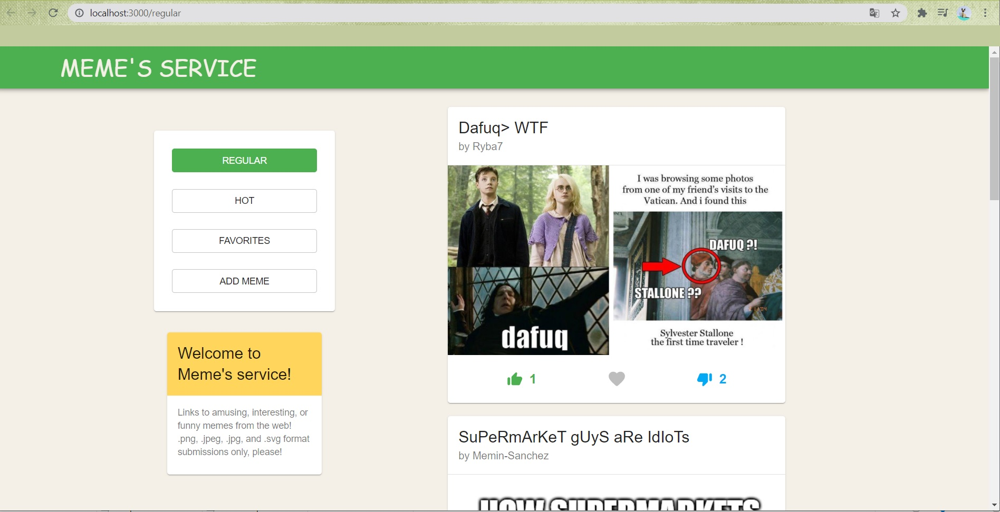
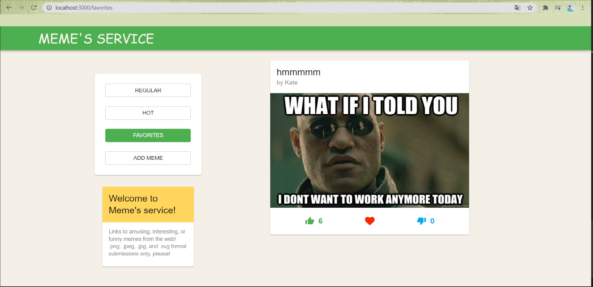
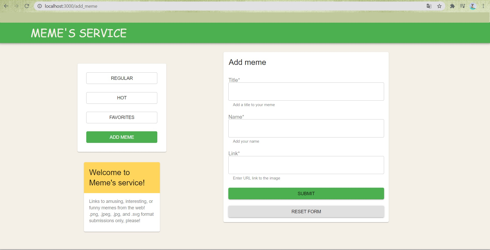
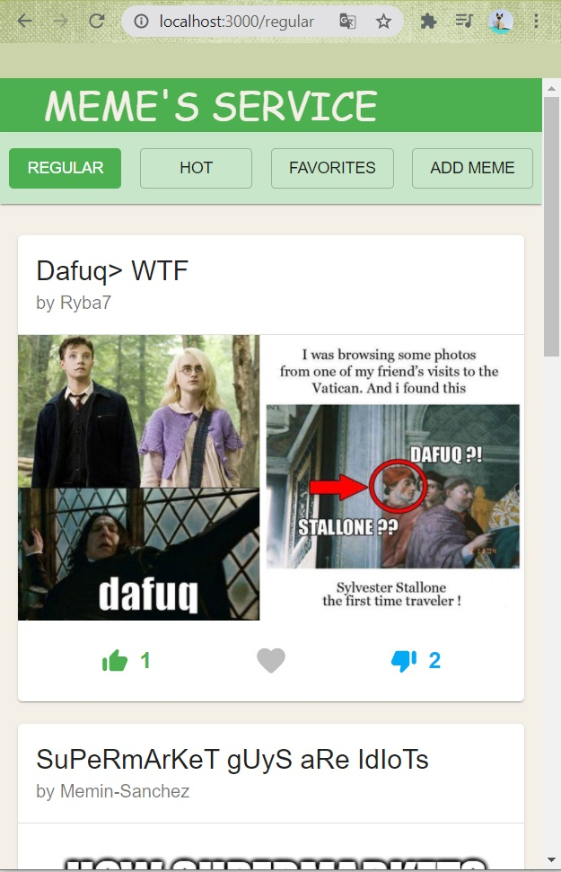

# memes-service

> A project based on React 17, React-Redux & Material-UI 4

---

This project was carried out for the purpose of completing postgraduate studies at the Leon Kozminski Academy in Warsaw in the field of Frontend development with React - application programming (2020/2021)
https://github.com/Olshyna/memes-service.git

The task of the application is:

- to display memes on two lists 'HOT' and 'REGULAR' depending on the number of ratings (upvote-downvote> 5 => 'HOT', other => 'REGULAR'),
- the ability to give upvote and downvote,
- mark a meme with a heart,
- to display your favorite memes,
- adding a new meme to the application using the form.

## Installation

```bash
# Clone project
git clone https://github.com/Olshyna/memes-service.git


# install the packages with npm
cd memes-service
npm install

# start the server with hot reload at localhost:3000
npm start
# or yarn
yarn start

```

### Screenshots









---
